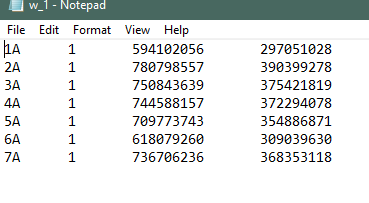
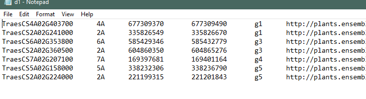
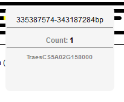
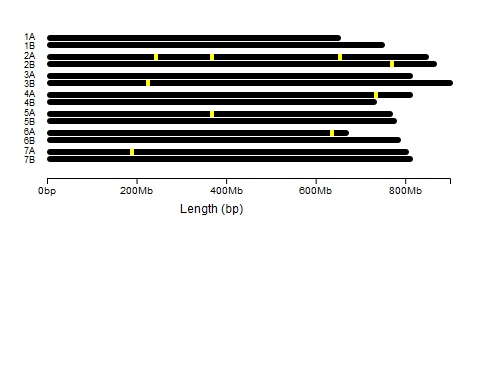
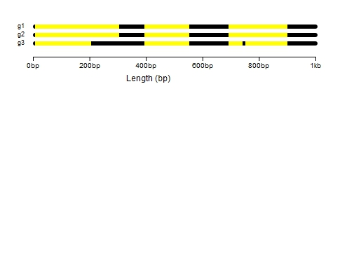
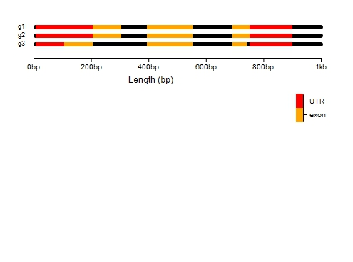
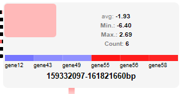
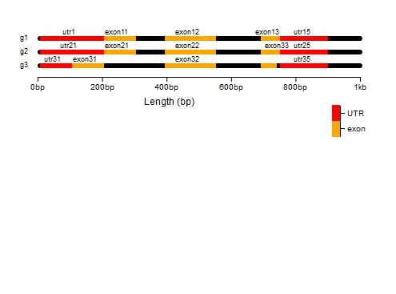

```{r setup, include = FALSE}
knitr::opts_chunk$set(
  collapse = TRUE,
  comment = "#>"
)
```

<style>
    
    h2,h3 {
        color: grey;
    }
</style>
**Author**: Lakshay Anand ( lakshayanand15@gmail.com )


`chromoMap` provides interactive, configurable and elegant graphics visualization of chromosomes or chromosomal regions allowing users to map chromosome elements (like genes,SNPs etc.) on the chromosome plot.Each chromosome is composed of loci(representing a specific range determined based on chromosome length) that, on hover, shows details about the annotations in that locus range. The plots can be saved as HTML documents that can be shared easily. In addition, you can include them in R Markdown or in R Shiny applications. 

Some of the prominent features of the package are:

- visualizing polyploidy simultaneously on the same plot.
- annotating groups of elements as distinct colors.
- creating chromosome heatmaps.
- adjusting chromosome range or visualizing chromosome regions such as genes
- adding labels to the plot
- adding hyperlinks to each element


## Getting Started

This vignette provide you with a description of how you can use the various features of `chromoMap` to create fantastic annotation plots. If you, however, want to know more about the applications of the plot, please check the publication or simply contact me. I recommend using the `RStudio` application since the interactive plots can be viewed beautifully in the application's viewer pane and it allows you to export the plot either as static image or a stand-alone HTML web page.  


### Install `chromoMap`

You can install the package by just typing the following commands:
```{r, eval=FALSE}
install.packages("chromoMap")

```

### Prepare Input Data Files
The `chromoMap` can be used to visualize and annotate chromosomes of any living organism. It is because it renders the chromosome based on the co-ordinate information that you will provide as input. So, if you have the genomic co-ordinates of the organism, you can create chromoMaps for it. 

The input data are tab-delimited text files (almost similar to the BED file format). It takes seperate files for the chromosomes and the annotations. The input files *should not* have column headers (however, I have explained each column type below)

#### Chromosome Files

This file contains the co-ordinates of the chromosomes. The columns of this file(in order) are described below (all columns are mandatory unless specified optional):

- **chromosome name**: a character representing the chromosome/contig/region name like 'chr1' or '1' or 'ch1'
- **chromosome start**: a numeric value to specify chromosome (or chromosome region) start position. If you are considering entire chromosome this value is typically 1.
- **chromsome end**: a numeric value specifying chromosome/contig/region end position. Again, if you are considering entire chromosome, then this value is the length of chromosome.
- **centromere start (optional)**: centromeres will be added automatically if you provide the its start cordinates. 

I have developed algorithm that will include both start and end cordinates of chromosomes so that users can also be able to visualize a region of chromosome (not necessarily starting at 1). You can use your imagination to visualize anything that has cordinates( like RNA as well).

Your chromosome file should look like:
<center>



</center>

#### Annotation Files

Once you have chromosome co-ordinates in file, the next thing is to have data for annotation. annotation elements could be anything that has co-ordinates like genes,SNPS, etc. the data is also provided in the same format.

- **Element Name**: a character specifying (uniquely) the elements. This can be identifiers,symbols etc.
- **Chromosome Name**: a character specifying the chromosome name. [NOTE: the chromosome names should be consistent in chromosome and data files.]
- **Element Start**: A numeric specifying element start position.
- **Element End**: A numeric specifying element end position.
- **Data(optional)**:  A numeric or character specifying the data value.
- **Hyperlinks(optional)**: a character specifying the URL of the element. 

your annotation file should look like:

<center>




</center>


<br><br>

To prevent you from making some possible errors, here are a few points to care about while preparing files:

- Do not include column headers in files.
- Chromosomes names should be consistent in both files.
- Elements and chromosome names (first column of both files) should be unique.


**TIP**: You can use MS excel to create your files and then use save as tab-delimited option.

## My first `chromoMap`

Once you have your input files ready, begin creating chromosomes plots like a pro. The simplest annotation plot can be created using the following command:

```{r,eval=FALSE}
library(chromoMap)
chromoMap("chromosome_file.txt","annotation_file.txt")
```

This will create a plot with default properties. Well, images included in this vignette are non-interactive, but you should see an interactive plot on RStudio's viewer pane.

<center>


</center>


that's it. you have created a simple annotation plot. now hover over the annotated loci to see the magic. you should see a tooltip describing:

- the range of the selected locus in bp
- the count showing total elments mapped at this locus
- the element(s) names mapped at this locus which is clickable

<center>



</center>

If you have added hyperlinks to the elements, you can click the element labels in tooltip to access the web page. 

well, on hover, the tooltip appear on the screen as long as your pointer is over the locus. It will disappear if you move the pointer away. I know, you must be thinking that the tootltip disappears before you can click to the element's hyperlink. Don't worry. 

**TIP**: You can click the locus to have a stable tooltip on screen. click again on same or other locus to hide it again.

If you are not satisfied with the default look of the plot(which I'm sure you wouldn't), you can play around with some of the properties to style your plot described under the section 'configuring `chromoMap`' in this vignette.

## Polyploidy
 Biologically speaking, chromosomes occur in sets. So, just visualizing a set of chromosome(called as haploid) wouldn't be sufficient in some scenarios. Hence, I added the feature of adding sets of chromosomes as seperate set of files. Don't forget to set the `ploidy` argument to the number of sets you are passing.
 
```{r,eval=FALSE}
chromoMap(c("chromosome_file_set_1.txt","chromosome_file_set_2.txt")
          ,c("annotation_file_set_1.txt","annotation_file_set_2.txt"), ploidy = 2)
```

<center>



</center>


polyploidy turned out to be a powerful feature that can actually be used in multiple ways. The sets of chromsomes are rendered independent of each other and, hence, can differ in number and size. Using this feature you can visualize polyploid sets, haploid sets of different species on same plot, or even different samples of same species for comparison. Be creative to use this feature to your own requirement. Some interesting examples I have included in my paper.


## Point and Segment-annotation plots

I have provided two types of annotation algorithms that will visualize the annotations differently. Point annotation will annotate an element on a single locus, ignoring its size. While, the segment-annotation algorithm consider the size and visualize the annotation as a segment. 

The default is point-annotation. To use segment annotation set the argument `segment_annotation` to `TRUE`. Segment annotations will be advantageous in cases like displaying gene structure. 

```{r,eval=F}
chromoMap("chromosome_file.txt","annotation_file.txt",segment_annotation = T)

```


here's a hypothetical example.

<center>



</center>

## Data-based annotation plots

Huge volume of biological data is being produced in today's world. I thought it would be nice to visualize the data associated with the chrosmome regions or elements. You can do this by creating data-based color annotations in `chromoMap`. Before going forward let's know about the data types chromoMap can handle. You can use either numeric  data or character/categorical data for annotations. For the type of data type you are using, you need to set the argument `data_type` to either `numeric` or `categorical`. Also, to use this category of plot, you need to set `data_based_color_map` to `TRUE`.Now let's explore the two major types of plots you can create.

### group-annotation plots

As the name suggests, this type of plot can be used if your annotations are categorized into groups. This plot will assign distict colors to each group. Your annotations file's data column should have groups assigned to each element as character value. 

IMPORTANT: the `data_colors` argument will specify the color for each group and must be passed as a list() of vectors. If the ploidy is 2, two vectors will be passed in list. Hence, you must pass each a vector for each ploidy in a list.

```{r,eval=F}
chromoMap("chromosome_file.txt","annotation_file.txt",
          data_based_color_map = T,
          data_type = "categorical",
          data_colors = list(c("orange","yellow")))

```

<center>



</center>

The best thing is, it will also create a legend for each group with labels used by you as group names. isn't it amazing? :) [see more under 'legends' section]

### chromosome heatmaps

Now, let's create the best plot of the year (just kidding :D). FYI chromosome heatmaps is the major inspiration I started developing this package. Anyways, chromosome heatmaps allow you to visualize numeric data as heat colors. In your annotations file, add numeric data in data column.

```{r,eval=FALSE}
chromoMap("chromosome_file.txt","annotation_file.txt",
          data_based_color_map = T,
          data_type = "numeric")
```

<center>


</center>

Yes, the legends are shown in this plot too. 

let's look at the tool tip:
<center>



</center>


`data_colors` can be used to set the heat colors also. It should be passed as a list of vector(s) with a vector for each ploidy.

####Data Aggregation
Well, remember that chromosomal locus in the plot is a range, and more than one elements can be annotated in that range. So, for the data assignment of the loci where multiple elements are mapped, I implemented an aggregation algorithm. The data for each locus will be determined by `aggregate_func` argument which can take either `avg` for average (default) or `sum` for summation of data values of all elemets mapped on that locus. 

So, if you want to use the sum function:

```{r,eval=FALSE}
chromoMap("chromosome_file.txt","annotation_file.txt",
          data_based_color_map = T,
          data_type = "numeric",
          aggregate_func = "sum")
```

You can use the different agregate functions for each ploidy by passing the argument as vector. Hence, for polyploidy, if only one value is passed, this value will be used for all sets.Otherwise, you can specify for each set as:

```{r,eval=FALSE}
chromoMap(c("chromosome_file_set_1.txt","chromosome_file_set_2.txt")
          ,c("annotation_file_set_1.txt","annotation_file_set_2.txt"), 
          ploidy = 2, data_based_color_map = T,data_type = "numeric"
          ,aggregate_func = c("avg","sum"))
```

Note: If only one element is annotated per loci, than the loci will take the element's data value.


## Customizing chromoMaps
Well, you want to change the looks of the plot. It's boring using default. Here, are the various options for you.


### width and height

You can configure the dimensions(width and height) of the plot by using the parameter `canvas_width` and `canvas_height`. 

```{r,eval=FALSE}
chromoMap("chromosome_file.txt","annotation_file.txt",
          canvas_width = 600,
          canvas_height = 700)
```

Well, when you try to use multiple ploidy, plot might go off the margins. You can adjust the width and height to fit the plot to your need. 

### Title

You can add a title to your plot by using `title` argument.

```{r,eval=FALSE}
chromoMap("chromosome_file.txt","annotation_file.txt",title = "my first chromoMap plot")
```


### Margins

You can adjust the left and top margins through `top_margin` and `left_margin`.

```{r,eval=FALSE}
chromoMap("chromosome_file.txt","annotation_file.txt",
          top_margin = 25,
          left_margin = 15)
```


### Chromosome colors 
You can change the color of each set of chromosome by using `chr_color` property.

```{r,eval=FALSE}
chromoMap("chromosome_file.txt","annotation_file.txt",
          chr_color = c("orange"))
```

For polyploidy, if only one color is passed it will be taken for all sets of chromsomes. Otherwise, you can assign color to each set:

```{r,eval=FALSE}
chromoMap(c("chromosome_file_set_1.txt","chromosome_file_set_2.txt")
          ,c("annotation_file_set_1.txt","annotation_file_set_2.txt"), 
          ploidy = 2,
          chr_color = c("pink","blue"))
```

**USEFUL TIPS** : 

- Use hexadecimal color codes to assign beautiful color shades to embelish your plot. 
- setting the chromosome color to white will make them appear invisible hence only colored annotations will be visible(might be helpful in some case).


### Annotation colors
For simply annotation plot, you can change the annotation color by using `anno_col` argument. 

```{r,eval=FALSE}
chromoMap("chromosome_file.txt","annotation_file.txt",
          anno_col = c("orange"))
```

For polyploidy, if you have passed one color value it will be taken for all the sets. Otherwise, you can pass distinct color values for each set:

```{r,eval=FALSE}
chromoMap(c("chromosome_file_set_1.txt","chromosome_file_set_2.txt")
          ,c("annotation_file_set_1.txt","annotation_file_set_2.txt"), 
          ploidy = 2,
          anno_col = c("pink","blue"))
```


NOTE: For data-based annotation plots(group or heatmaps), colors are controlled by `data_colors` argument which is list of vector(s).

### Chromosome width, length, and spacing

Do you think chromosomes appear too thin or too short for your annotations? well, you can adjust these parameters by using `chr_width` and `chr_length` arguments.

```{r,eval=FALSE}
chromoMap("chromosome_file.txt","annotation_file.txt",
          chr_width = 4,
          chr_length = 5)
```


the spacing between chromsomes can be adjusted with `ch_gap` argument.

```{r,eval=FALSE}
chromoMap("chromosome_file.txt","annotation_file.txt",
          ch_gap = 6)
```

### Chromosome text
Well, the chromosome text will be taken from file you have provided. The only thing I thought might be useful is to enable or disable text individually for each ploidy. This is done by using `chr_text` parameter.
```{r,eval=FALSE}
chromoMap("chromosome_file.txt","annotation_file.txt",
          chr_text = F) 
```

For multiple ploidy pass a vector:
```{r eval=FALSE}
chromoMap(c("chromosome_file_set_1.txt","chromosome_file_set_2.txt")
          ,c("annotation_file_set_1.txt","annotation_file_set_2.txt"), 
          ploidy = 2,
          chr_text = c(T,F))
```

### vertical alignment

Well, you can align chromsome vertically by using `v_align` option.

```{r,eval=FALSE}
chromoMap("chromosome_file.txt","annotation_file.txt",
          v_align = T) 
```


## Legends

legends are provided for data-based annotation plots. It is hidden by default. Use `legend` option to enable it.

```{r,eval=FALSE}
chromoMap("chromosome_file.txt","annotation_file.txt",
          data_based_color_map = T,
          data_type = "categorical",
          legend = T) 
```

For polyploidy, you can enable or disable the legend independently for each set.

```{r eval=FALSE}
chromoMap(c("chromosome_file_set_1.txt","chromosome_file_set_2.txt")
          ,c("annotation_file_set_1.txt","annotation_file_set_2.txt"), 
          ploidy = 2,
          data_based_color_map = T,
          data_type = "numeric",
          legend = c(F,T))
```


### positioning legends

I know, the legends in your plot are present weirdly?. I have made the postion of legends independent of the plot and hence you can position it anywhere in the plot you want using the y and x direction length. Consider the orgin to be the bottom right corner of the plot now tweak the `lg_x` and/or `lg_y` arguments to adjust the positioning of the legend.

```{r,eval=FALSE}
chromoMap("chromosome_file.txt","annotation_file.txt",
          data_based_color_map = T,
          data_type = "categorical",
          legend = T, lg_x = 100,
          lg_y = 250)
```


## Labellings

This feature I added at the end thought might be useful in some scenarios. This will show the labels (element names) on top of locus. It is disabled by default, to enable it use `label` argument.

```{r,eval=FALSE}
chromoMap("chromosome_file.txt","annotation_file.txt",
          labels=T)
```

A hypothetical example:

<center>



</center>

NOTE: the labellings might not look good if the label names are long and annotations are close. If it appear good on plot you can use this feature. Also, remember if your annotations are close, you can adjust the chromosome range to make them apart. the range of each locus is determined algorithmically based on chromosome length. **Also, the labels are only displayed for ploidy=1, i.e, for only first/one set of chromosomes**. A warning, labelling require the element names(first column) to be unique.

## Hyperlinks

Last, but not the least, this feature will allow you add hyperlinks with elements. Add hyperlinks in annotations file and don't forget to use `hlinks` argument to enable it.

```{r,eval=FALSE}
chromoMap("chromosome_file.txt","annotation_file.txt",
          hlinks=T)
```

## Exporting chromoMaps 

The `RStudio` allows the option to export the graphics, shown in its veiwer's pane ,as either a static image or a web page. Use this feature to either save chromaps as static images and include them into your documents or papers, or export interactive plots as standalone-html to include them as supplementary materials in publications.


## Including chromoMaps in Shiny Applications

You can include chromoMaps in Shiny application by using the function `chromoMapOutput()` in the UI part of the code and `renderChromoMap()` in the server part of the code.

#### Shiny Application example

```{r,eval=FALSE}
library(shiny)
library(chromoMap)

# Define UI for application that draws chromoMap
ui <- fluidPage(
   
   # Application title
   titlePanel("An example of chromoMap in Shiny"),
   
   # you can use GUI controls for your chromoMap
   sidebarLayout(
      sidebarPanel(
         #some code
      ),
      
      # Show a plot of the generated distribution
      mainPanel(
         chromoMapOutput("myChromoMap")
      )
   )
)

# Define server logic required to draw chromoMap
server <- function(input, output) {
   
   output$myChromoMap <- renderChromoMap({
     chromoMap("chromosome_file.txt","annotation_file.txt")
   })
}

# Run the application 
shinyApp(ui = ui, server = server)

```


## license
The chromoMap package is distributed under GPL-3 (GNU GENERAL PUBLIC
LICENSE version 3).

## Contact 
You are welcome to send feedback or bug reports through e-mail lakshayanan15@gmail.com

## Session Info
```{r}
 sessionInfo()
```