```{r setup, include = FALSE}
knitr::opts_chunk$set(
  collapse = TRUE,
  comment = "#>"
)
```

<style>
    
    h2,h3 {
        color: grey;
    }
</style>
**Author**: Lakshay Anand ( lakshayanand15@gmail.com )


`chromoMap` provides interactive, configurable and elegant graphics visualization of the human chromosomes allowing users to map chromosome elements (like genes,SNPs etc.) on the chromosome plot. It introduces a special plot viz. the "chromosome Heatmaps" that, in addition to mapping elements, can visualize the data associated with chromosome elements (for eg. gene expession) in the form of heat colors which can be highly advantageous in the scientific interpretations and research work. Bacause of the large size of the chromosomes, it is impractical to visualize each element on the same plot. However, the chromoMap provides a magnified view for each of chromosome location to render additional information and visualization specific for that location. You can map thousands of genes and can view all mappings easily.Users can investigate the detailed information about the mappings(like gene names or total genes mapped on a location) or can view the magnified single or double stranded view of the location showing each mapped element in sequential order.  The plots can be saved as cutomizable HTML documents that can be shared easily. In addition, you can include them in R Markdown or in R Shiny applications. 


## Introduction

Chromosomes are genetic material consisting of essential elements ,like genes , that spans over the length of the chromosome. Mapping an element on the chromosome is a task of marking the element position on that chromosome. Chromosomes are usually very large and can consist of several thousands of elements. This pose a restriction in their visualization as all the elements cannot be practically marked on a chromosomes in a restricted canvas size. `chromoMap` is designed to create chromosome visualizations that can be used for mapping elements based on their position on the chromosome while allowing the users to view each mapping on the same plot. The plot display 22 autosomes, an X chromosome, a Y chromosome, and also the mitochondrial chromosome(Mt).  All the chromosomes, except the Mt chromosome, are represented as linear bars with approximate relevant lengths and centromere positions. While the Mt chromosome is represented as a circular ring. Each chromosome , for the sake of including all positions, is divided into sections called as chromosome loci. Each locus is actually a genomic range(measured in bp) on the chromosome.Expectedly, more than one element can be mapped on a single locus. In that case, the plot visualize the mapping by painting the locus bar with color. However, users can hover over the locus bar to investigate detailed mappings for a locus. Users can also create chromosome heatmaps to visualize element-associated data on the plot. 


The chromoMap provide the users to create three types of chromosome plots:

- **Annotation**: This visualize a basic plot that annotate the elements on the chromosomes with single color.On hovering over a location, Users can view the total number of elements mapped on that location along with their names in sequential order(in which they are mapped on the chromosome).

- **Heatmap-single**: This plot is a chromosome heatmap that annotate the elements on the chromosome with heat colors(depend on the associated data for the element). The overall plot display an averaged heatmap i.e each location represent average data for all the elements in that location. On hovering over a location, users can view detailed heatmap for each element (almost like a magnified view for a location).A single strand is displayed with all elements placed on it in actual sequence and with actual heat color assigned to them.

- **Heatmap-double**: This allows users to add secondary data for the elements. This plot  display the heatmap with respect to the first data but also visualize the heatmap of secondary data (in magnified view) on a second strand placed in parallel for comparing the data of elements on same location. Hence, users can compare the element data in single plot.


## Installation

Users can simply install the package with following command on R console:
```{r, eval=FALSE}
install.packages("chromoMap")

```

## Input Data

The data required for creating chromoMaps is in the form of R `data.frame` with each column providing specific aspect of the data. 

For basic annotation the data must contain the following columns:

- **name**: [type- `character`] names of the elements for mapping, eg. gene names like "TP53"" or "NANOG".
- **chrom**: [type-`character`] the chromosome name for the gene. It should be  provided in format as "chr1","chr2","chrX",or "chrMT". Incorrect format can produce errors.
- **start**: [type- `numeric`] the starting position of the element.


For heatmaps, you need to add the additional columns for providing the data information for each element. These are provided as:

- **data**: [type- `numeric` or `integer`] primary data
- **secondData**:[type- `numeric` or `integer`] secondary data for heatmap-double.


The package is included with a dataset `pancandata` to get started with.You can use the data with following commands:

```{r}
library(chromoMap)
data("pancandata")

```

This will load the dataset into R workspace. `pancandata` is the dataset of pancreatic cancer obtained from The Cancer Genome Atlas database. The dataset consist of two data `data1` and `data2`. 

`data1`  consist of annotation information of 630 genes that were predicted as differentially expressed in case of pancreatic cancer. It is a `data.frame` emulating the format of input data required for annotation using `chromoMap`. You can access `data1` by using `pancandata$data1` as:

```{r}
head(pancandata$data1,10)
```

However, for demonstration of "heatmap-double" type of chromosome plot, another data, `data2` ,is provided that also contains secondary data. `data2` is actually data for gene expression values of 25,465 genes for one normal sample and one tumor sample. This data is also used to demonstrate how thousands of genes can be annotated on the plot.

To view `data2` use:

```{r}
head(pancandata$data2,10)
```

the `data` column contains the normal gene expression values while the `secondData` column contains tumor expression values. 

Note- The `chromoMap` will take the data in this format only. Make sure the column names are as given above. The dataset included in this package has been pre-processed and converted into the format required for mapping. We will us the given dataset in this vignette.


## Basic Annotation

As the most simple chromosome plots, `chromoMap` provide annotation plots that can be constructed as:

```{r,eval=FALSE}
library(chromoMap)
data("pancandata")
chromoMap(pancandata$data1,type = "annotation")
```
<center>
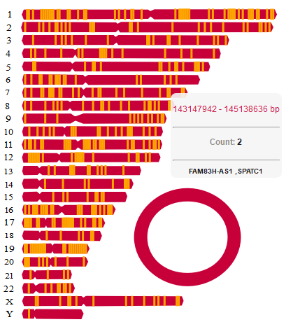


</center>


The genes are mapped or annotated on the chromosomes as shown. Hover over each of the annotated locations to view more information.

The tooltips will show the following data:

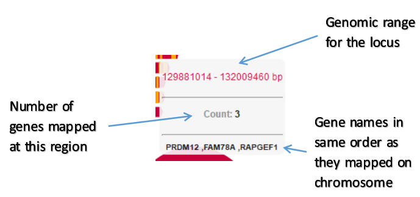


## The Chromosome Heatmaps

`chromoMap` can be used to plot chromosome heatmaps that can ,in addition to mapping elements on the chromosomes, visualize the data as heat colors. Two categories of chromosome heatmap plots can be created:

### Heatmap-single 

heatmap-single will take only single data for each element and visualize the data in single strand.

```{r,eval=FALSE}
library(chromoMap)
data("pancandata")
chromoMap(pancandata$data1,type = "heatmap-single")
```
<center>
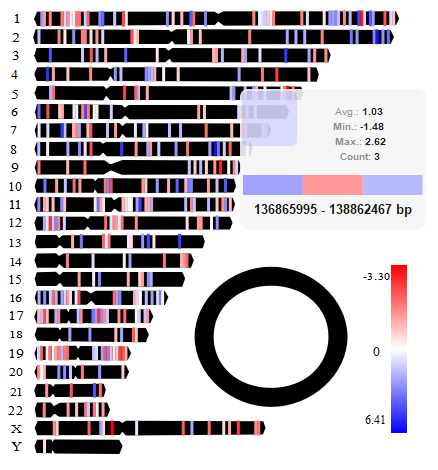

</center>


Note:
The entire plot is showing averaged data heatmap for each of location mapped, i.e, heat color is assigned based on the average value of data at a given location. For viewing actual data heatmap for each of the mapped gene, hover over the locations. The toottips shows folowwing data:

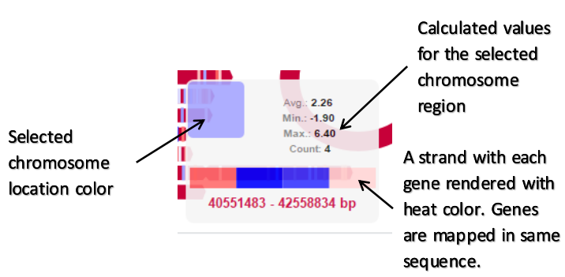


### Heatmap-double

A special kind of heatmap plot is the `heatmap-double` plot that will take secondary data in addition to the primary data for each element.

Such a plot can be obtained by:
```{r,eval=FALSE}
library(chromoMap)
data("pancandata")
chromoMap(pancandata$data2,type = "heatmap-double")
```

<center>
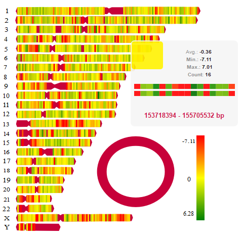

</center>

You can see the heatmap is generated similar to as before but when you hover over the locations it shows a second strand representing the secondary data heatmap. This could be very helpful for comparison. 


The tooltips incorporate the following data:

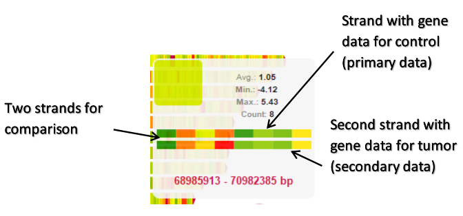


The `pancandata$data2` used for this plot consist of the secondary data. The above plot demonstrate the expression distribution of all genes in normal and tumor condition. As you can see from the two strand comparison, the heat colors difference for the same gene location shows difference in expression level. The plot can be potentially used for such comparisons related to the genes or other chromosome element data.


## Customizing chromoMaps
You must have noticed the difference in colors in the above plot. Yes! you can easily customize the properties of the plot to make them visually appealing and elegant by just passing a few parameters. 


### Resizing

You can configure the dimensions(width and height) of the plot by using the parameter `dim` . It is a `numeric` vector that takes the width and height of the plot.

```{r,eval=FALSE}
library(chromoMap)
data("pancandata")
chromoMap(pancandata$data1,type = "annotation",dim = c(450,400))
```


### Orientation

By default the plot produces horizontal chromosomes. You can change the alignment of the plot to vertical by using the parameter `align`.

```{r,eval=FALSE}
library(chromoMap)
data("pancandata")
chromoMap(pancandata$data2,type = "heatmap-double",align = "vertical")
```

<center>
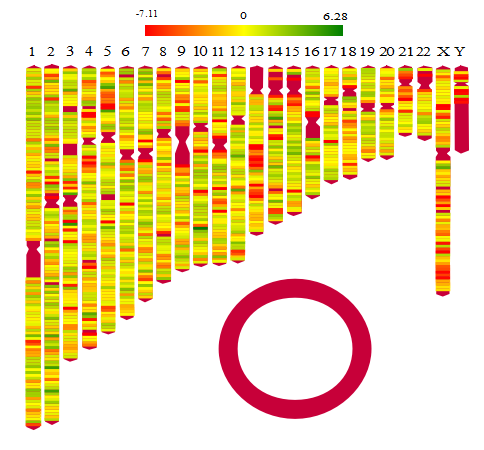


</center>

### Chromosome Styling

You can change the color of the chromosomes. The chromosomes are painted with two colors. One that define its border and the other that defines its body. You can the parameters `chBorder` and `chCol` to change the colors of the chromosome border and body respectiely.

#### Monocolor-style

To use the single color for entire chromosome you need to pass same color values to `chCol` and `chBorder`.

```{r,eval=FALSE}
library(chromoMap)
data("pancandata")
chromoMap(pancandata$data1,chCol = "blue",chBorder = "blue")
```


<center>
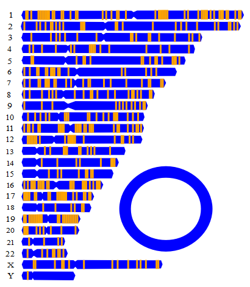


</center>

#### Border-style
You can ofcourse pass different color values to differentiate the chromosome borders from body. By passing the `chCol` as "white" you can make the chromosome body appear to be transparent and can produce a "wired-theme" chromosome.

```{r,eval=FALSE}
library(chromoMap)
data("pancandata")
chromoMap(pancandata$data1,chCol = "white",chBorder = "green")
```


<center>


</center>

#### Annotation-Color

You can change the annotation color used in annotation type plot by using the `annoColor` parameter.

```{r,eval=FALSE}
library(chromoMap)
data("pancandata")
chromoMap(pancandata$data1,annoColor = "pink")
```

<center>
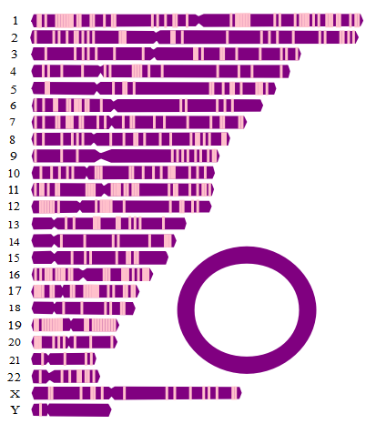

</center>


### Text Styling 
You can change the color of the text in plot by using the parameter `textCol`.

```{r,eval=FALSE}
library(chromoMap)
data("pancandata")
chromoMap(pancandata$data1,textCol = "green")
```

### Background Styling

You can style the bacground of the plor by changing background and border.

#### Border
You can change the border color of the background of the plot by using the `bgBorder` parameter. 

```{r,eval=FALSE}
library(chromoMap)
data("pancandata")
chromoMap(pancandata$data1,bgBorder  = "#FF5733")
```

<center>
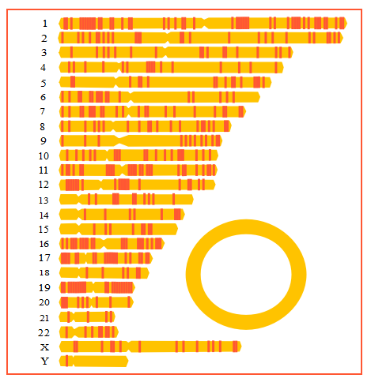

</center>

#### Background-color

Use the `bgCol` parameter for this.

```{r,eval=FALSE}
library(chromoMap)
data("pancandata")
chromoMap(pancandata$data2,type="heatmap-double",bgCol  = "black")
```


<center>
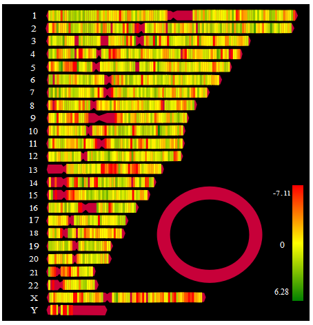


</center>

### Changing Heat colors
Heat colors are vital part of a heatmap. The variations in the color manifests the variations in the data. Heat colors are defined by the `HeatColRange` parameter that takes three color values as a `character` vector. The three colors corresponds to the minimum,medium,and maximum values of the data. The continuous scale of colors is automatically made for the data in between. By default the heat colors red,white and blue are assigned for min, mid, and max. You can change the color options to produce different color scales. The scale is displayed in a legend. 

```{r,eval=FALSE}
library(chromoMap)
data("pancandata")
chromoMap(pancandata$data2,type="heatmap-double",HeatColRange = c("red","yellow","green"))
```


## Sharing chromoMaps as customizable HTML Documents

The interactive chromosome plots produced by `chromoMap` can be saved as HTML documents which can be customized to include user data. The function `chromoMapToHTML()` is used for this purpose. The function provide the feature to:

- Save your plot as an HTML document that can be shared.
- Add Title to your document using `title` parameter.
- Add brief notes or description about the plot using `description` parameter.
- Use the boolean parameter `openAfterSave` to tell funtion to open your file automatically after saving it.

Please note that you must pass the filename and directory parameter.


```{r,eval=FALSE}
library(chromoMap)
data("pancandata")
#use a variable to store your chromoMap
chmap = chromoMap(pancandata$data2,type="heatmap-double",HeatColRange = c("red","yellow","green"))

#pass this to the function
chromoMapToHTML(chmap,file = "myfile.html",dir = "C:/Users/myfolder")

#pass a title 
chromoMapToHTML(chmap,title = "Expression profile Comparison in normal vs tumor",file = "myfile.html",dir = "C:/Users/myfolder")

#pass a description
my_desc = "you can write a paragraph to describe your plot"

chromoMapToHTML(chmap,title = "Expression profile Comparison in normal vs tumor",description = my_desc)

#open document after save
chromoMapToHTML(chmap,title = "Expression profile Comparison in normal vs tumor",description = my_desc,openAfterSave = TRUE)

```


 


## Including chromoMaps in Shiny Applications

You can include chromoMaps in Shiny application by using the function `chromoMapOutput()` in the UI part of the code and `renderChromoMap()` in the server part of the code.

#### Shiny Application example

```{r,eval=FALSE}
library(shiny)
library(chromoMap)

# Define UI for application that draws chromoMap
ui <- fluidPage(
   
   # Application title
   titlePanel("An example of chromoMap in Shiny"),
   
   # you can use GUI controls for your chromoMap
   sidebarLayout(
      sidebarPanel(
         #some code
      ),
      
      # Show a plot of the generated distribution
      mainPanel(
         chromoMapOutput("myChromoMap")
      )
   )
)

# Define server logic required to draw chromoMap
server <- function(input, output) {
   
   output$myChromoMap <- renderChromoMap({
     chromoMap(pancandata$data1,type = "annotation")
   })
}

# Run the application 
shinyApp(ui = ui, server = server)

```


## license
The chromoMap package as a whole is distributed under GPL-3 (GNU GENERAL PUBLIC
LICENSE version 3).